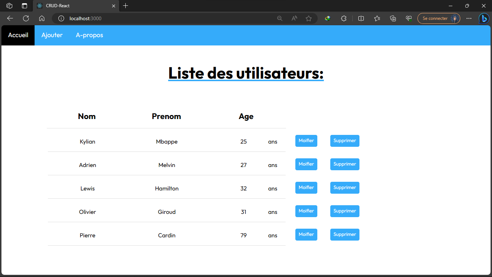
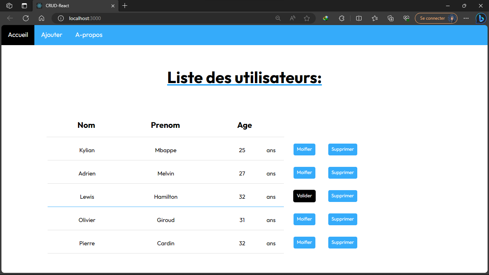
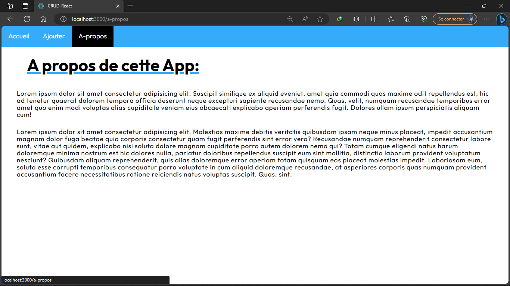
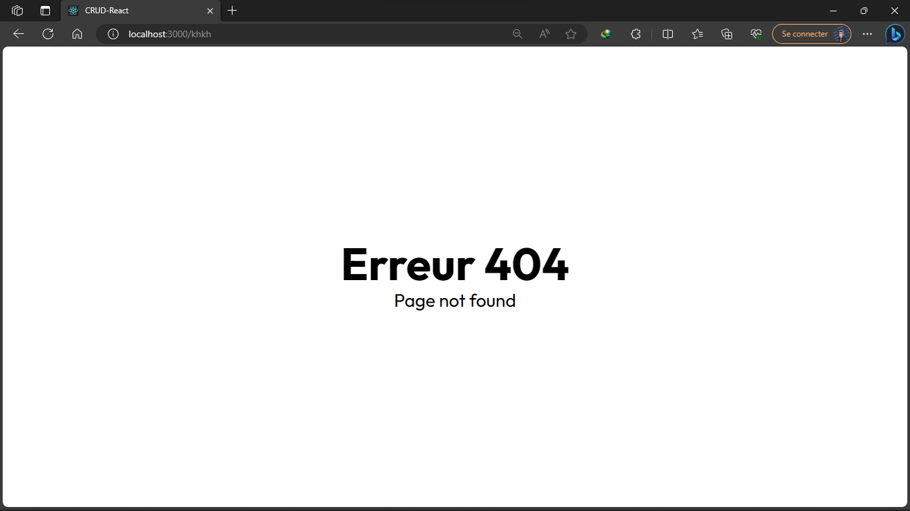

# CRUD application with React
This is a simple Basic CRUD application with 4 pages made with React and JSON Server.
## Screenshots
### `Home`

- #### Home & edit & update

### `Create page`
- #### Create success

- #### Create error

### `About page`

### `404 error`

## Author
- Github: [Velomary Andriamasy](https://github.com/Velomary/)
- Facebook: [Velomary Andriamasy](https://www.facebook.com/velomary.andriamasy)
- Instagram: [velomary_](https://www.instagram.com/velomary_/)
- Linkedin: [Velomary](https://www.linkedin.com/in/velomary-mahavoitsy-6a2a97266/)